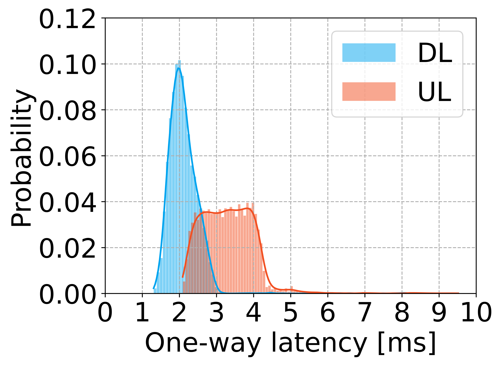
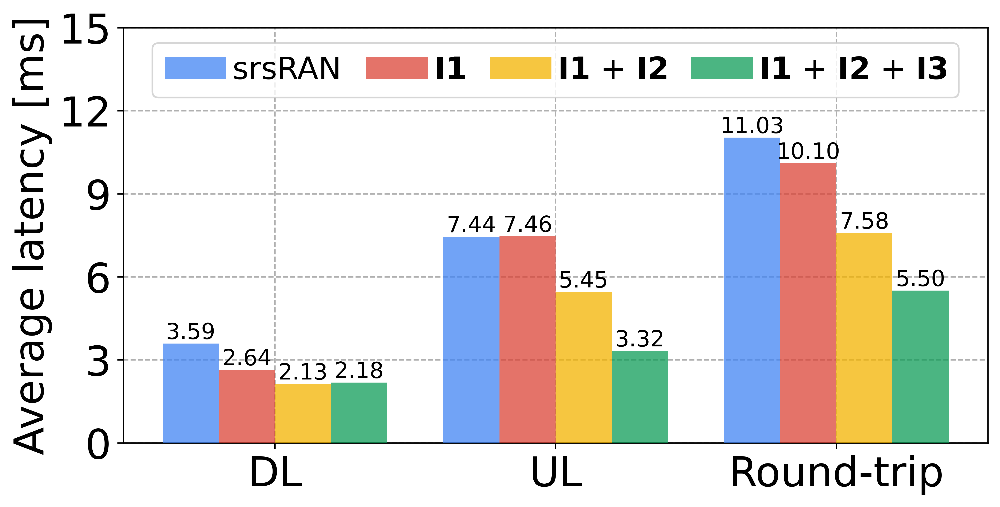

# Towards URLLC with Open-Source 5G Software

[Aoyu Gong](https://aygong.com/), [Arman Maghsoudnia](https://people.epfl.ch/arman.maghsoudnia), [Raphael Cannatà](https://www.raphaelcannata.com/), [Eduard Vlad](https://evlad.de/), [Néstor Lomba Lomba](https://www.linkedin.com/in/nlomba), [Dan Mihai Dumitriu](https://www.linkedin.com/in/dmdumitriu), [Haitham Hassanieh](https://people.epfl.ch/haitham.alhassanieh?lang=en)

[Paper] [Slides] [Citation]

## 🧭 Overview

<div align="center">
  <p>
     &nbsp;&nbsp;&nbsp;&nbsp;
    
  </p>
</div>

This repository contains the code for our paper: 
> Towards URLLC with Open-Source 5G Software


## 🔧 Environment Setup

Our modifications are built on top of the original [srsRAN](https://github.com/srsran/srsRAN_Project).  
- To build and run our modified version, please follow the same environment setup instructions as described in the official [srsRAN README](/srsRAN_README.md).


## ⚙️ gNB Configuration Parameters

> You can find the full list of srsRAN configuration parameters [here](https://docs.srsran.com/projects/project/en/latest/user_manuals/source/config_ref.html).

We introduce four new configuration parameters to support low-latency modifications:

- `sr_free_access_enable`
    - Enables Scheduling Request (SR)-free access to the slice. 
    - Optional BOOLEAN (true). Supported: [false, true].
- `min_ul_grant_size`
    - Specifies the minimum size (in bytes) of uplink grants assigned to the slice.
    - Optional INT (0). Supported: [0 - 100000].
- `max_proc_delay`
    - Sets the maximum allowed DL processing delay in slots.
    - Optional FLOAT (5.0). Supported: [0.0 - 30.0].
    - This value corresponds to the $M$-slot offset.
- `radio_heads_prep_time`
    - Sets the maximum allowed preparation time for radio heads in milliseconds.
    - Optional INT (3). Supported: [1 - 30].
    - This value corresponds to the $H$-slot offset.

ℹ️ Note: We have extended the original `max_proc_delay` parameter to support `FLOAT` in addition to `INT`.

🧾 Example Configuration:

```
cell_cfg:
  slicing:
    - sst: 1
      sd: 0
      sched_cfg:
        sr_free_access_enable: false
        min_ul_grant_size: 512

expert_phy:
  max_proc_delay: 0.5
  radio_heads_prep_time: 1
```

💡 An example YAML configuration file is provided [here](/configs/gnb_low_latency.yml).


## 📄 Citation

If you find the codebase helpful, please consider giving a ⭐ and citing our paper:
```bibtex
@inproceedings{sens2025urllc,
  title={Towards URLLC with Open-Source 5G Software},
  author={Gong, Aoyu and Maghsoudnia, Arman and Cannatà, Raphael and Vlad, Eduard and Lomba Lomba, Néstor and Dumitriu, Dan Mihai and Hassanieh, Haitham},
  booktitle={Proceedings of the 2025 SIGCOMM Workshop on Open Research Infrastructures and Toolkits for 6G (OpenRIT6G '25)},
  year={2025},
  publisher={Association for Computing Machinery},
  address={New York, NY, USA}
}
```


## 😋 Questions or Issues?

If you run into problems or have suggestions, feel free to open an issue or reach out to us.